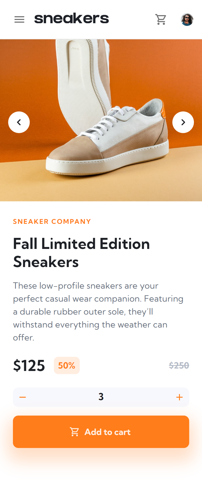
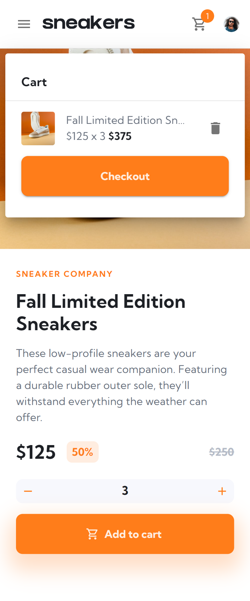
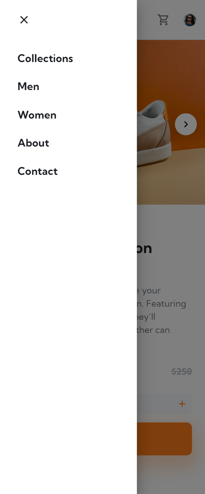
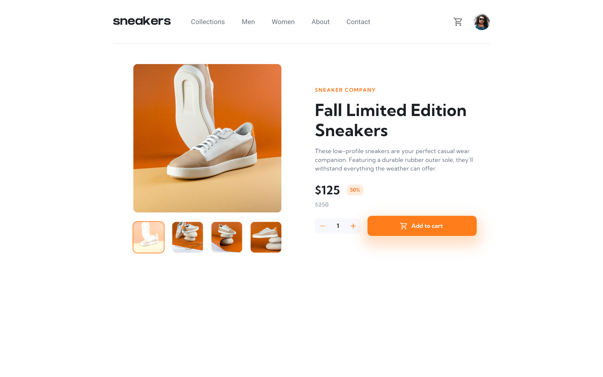
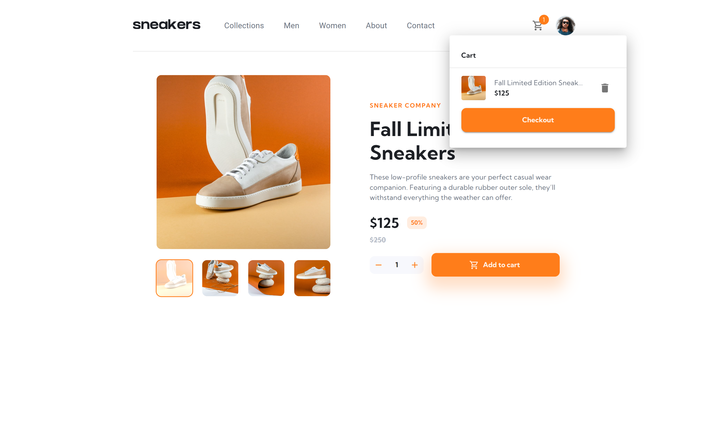
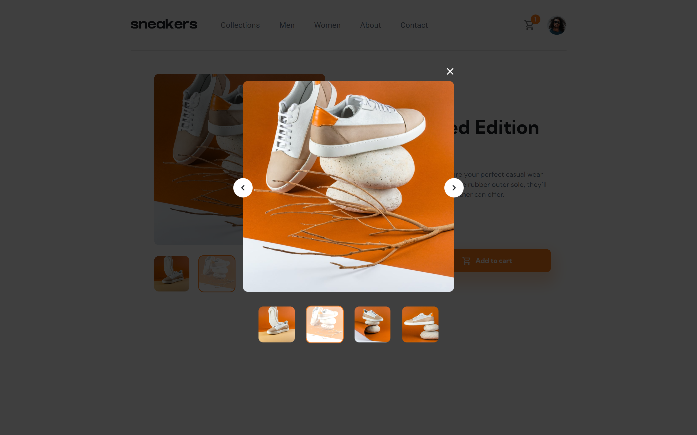

# Frontend Mentor - E-commerce product page solution

This is a solution to the [E-commerce product page challenge on Frontend Mentor](https://www.frontendmentor.io/challenges/ecommerce-product-page-UPsZ9MJp6). Frontend Mentor challenges help you improve your coding skills by building realistic projects.

## Table of contents

- [Overview](#overview)
  - [The challenge](#the-challenge)
  - [Screenshot](#screenshot)
- [My process](#my-process)
  - [Built with](#built-with)
  - [What I learned](#what-i-learned)
  - [Useful resources](#useful-resources)
- [Author](#author)

## Overview

### The challenge

Users should be able to:

- View the optimal layout for the site depending on their device's screen size
- See hover states for all interactive elements on the page
- Open a lightbox gallery by clicking on the large product image
- Switch the large product image by clicking on the small thumbnail images
- Add items to the cart
- View the cart and remove items from it

### Screenshot

## My process

### Built with

- [React](https://reactjs.org/) - JS library
- [TypeScript](https://www.typescriptlang.org/) - JS Superset
- [Redux Toolkit](https://redux-toolkit.js.org/) - State Management
- [Material UI](https://mui.com/) - UI Components and Styling

### What I learned

My goal for this project was a take a realistic project and use it to learn both Material UI and Redux Toolkit. I learned a great deal about both in my implementation of this e-commerce app, including theme customizations, styled components, and Redux data flow.

### Useful resources

- [React / Material-UI: Use variable reference in custom theme](https://stackoverflow.com/a/69296034) - Provides a process for using theme palette customizations inside of styleOverrides by creating multiple themes and merging them into one.
- [MUI 5 styled() pass props along with theme object](https://github.com/mui/material-ui/issues/29207#issuecomment-949283534) - Explanation for passing props to styled components with TypeScript 

## Author

- Website - [Justin Fowler Art](https://www.justinfowlerart.com)